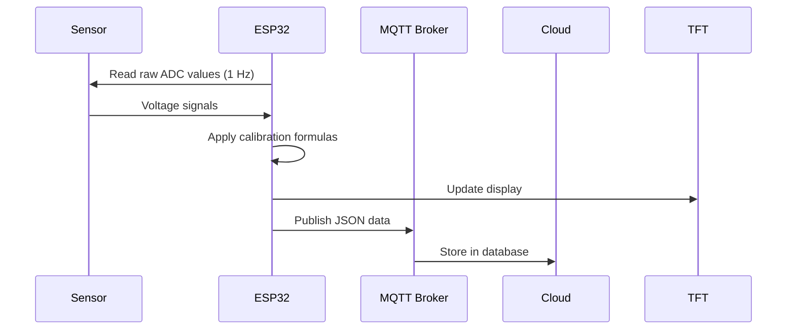
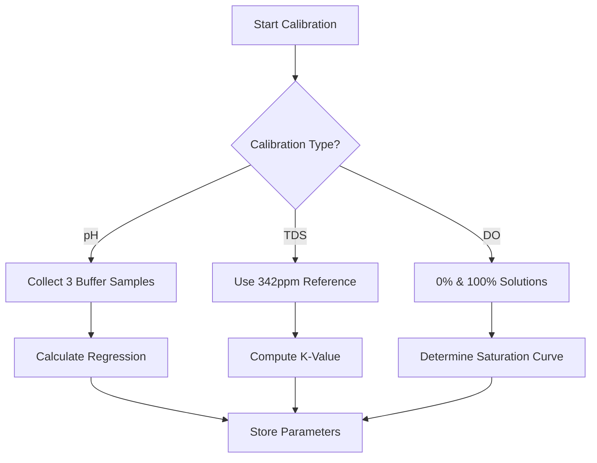

## **ELSA IoT Water Quality Monitoring System**  

## **I. Technical Documentation**  
### A. System Architecture  
#### 1. Hardware Components  
| Component          | Specification                          | Purpose                           |  
|--------------------|----------------------------------------|-----------------------------------|  
| **MCU**            | ESP32-S3 (240 MHz Dual-Core)           | Main processor & connectivity     |  
| **ADC**            | ADS1115 (16-bit, 4-channel)            | Sensor signal digitization         |  
| **pH Sensor**      | Analog pH probe (0–14 pH)              | Acidity measurement                |  
| **TDS Sensor**     | TDS probe (0–1000 ppm)                 | Total dissolved solids measurement |  
| **DO Sensor**      | Galvanic DO probe (0–20 mg/L)          | Dissolved oxygen measurement      |  
| **Temperature**    | DS18B20 (Digital, -55°C to +125°C)     | Temperature compensation          |  
| **Display**        | ILI9341 TFT (320x240, SPI)             | Local data visualization          |  
| **RTC**            | DS3231 (±2 ppm accuracy)               | Timekeeping & data timestamping   |  

#### 2. Software Architecture  
```
┌──────────────────────┐  
│    Main Firmware     │  
├──────────────────────┤  
│  - Task Scheduler    │ ◄─ 1s intervals  
│  - Sensor Drivers    │  
│  - MQTT Client       │  
│  - NVS Storage       │  
└──────────┬───────────┘  
           │  
┌──────────▼───────────┐  
│   Arduino Core ESP32 │  
└──────────────────────┘  
```

---

### B. MQTT Protocol Detail  
#### 1. Publish Topics  
| Topic               | Frequency | Payload Example                          |  
|---------------------|-----------|------------------------------------------|  
| `elsaiot/ELSA-1A2B/data` | 1 Hz      | [Sensor data JSON](#payload-definitions) |  
| `elsaiot/ELSA-1A2B/status` | On boot  | `{"event":"boot","device_id":"ELSA-1A2B"}` |  

#### 2. Subscribe Topics  
| Topic               | Command Format                          | Acknowledgment Topic      |  
|---------------------|----------------------------------------|---------------------------|  
| `elsaiot/ELSA-1A2B/calibrate` | [Calibration JSON](#calibration-methods) | `elsaiot/ELSA-1A2B/ack/calibrate` |  
| `elsaiot/ELSA-1A2B/offset`    | [Threshold JSON](#threshold-settings)   | `elsaiot/ELSA-1A2B/ack`    |  

---

### C. Sensor Calibration Algorithms  
#### 1. pH Sensor (Linear Regression)  
**Formula:**  
```cpp
ph_calibrated = (ph_regression_m * voltage) + ph_regression_c;
```
**Storage:** `ph_m` and `ph_c` in NVS  

#### 2. TDS Sensor (K-Value Adjustment)  
**Formula:**  
```cpp
tds_k_value = standard_value / (raw_reading * temp_compensation);
```
**Storage:** `tds_k_value` in NVS  

#### 3. DO Sensor (Two-Point Calibration)  
**Formula:**  
```cpp
v_saturation = (temp - cal2_temp)*(cal1_volt - cal2_volt)/(cal1_temp - cal2_temp) + cal2_volt;
do_value = (voltage * DO_Table[temp_index]) / v_saturation;
```
**Storage:** `do_cal1_volt`, `do_cal1_temp`, `do_cal2_volt`, `do_cal2_temp`  

---

## **II. User Documentation**  
### A. Initial Setup  
1. **Power On**  
   - Wait for TFT to display "System Ready"  
   - Note WiFi AP name (e.g., `ELSA-1A2B`)  
2. **WiFi Configuration**  
   - Connect to AP via smartphone/PC (password: `12345678`)  
   - Portal auto-opens → Select your WiFi network  
3. **Dashboard Access**  
   - Login to `https://elsaiot.web.id` with credentials  
   - Device appears online after 60 seconds  

---

### B. Step-by-Step Calibration Tutorial  
#### 1. pH Calibration (Web Interface)  
**Requirements:** pH 4.01, 7.00, 10.01 buffer solutions  

| Step | User Action | System Response |  
|------|-------------|-----------------|  
| 1    | Click "Calibrate" → "pH" → "Start" | Web initiates 3-step wizard |  
| 2    | Immerse probe in pH 7.00 buffer → Click "Capture" | Device sends `{"ph": {"raw":7.12, "voltage":2.89}}` |  
| 3    | Repeat for pH 4.01 and 10.01 buffers | Web plots regression curve |  
| 4    | Click "Apply Calibration" | Dashboard sends:  `{"ph":{"m":1.025,"c":-0.12}}`
| 5    | Confirm success via TFT "Calibrated" status | Device stores values in NVS |  

#### 2. DO Sensor Calibration (Mobile App)  
**Requirements:** Sodium sulfite solution (0% O₂), Air-saturated water (100% O₂)  

1. Open ELSA IoT App → Device → DO Calibration  
2. Select calibration type:  
   - **Single-Point:** Immerse in air-saturated water → Enter temperature → Confirm  
   - **Two-Point:**  
     - Step 1: 0% solution → Capture  
     - Step 2: 100% solution → Capture  
3. App calculates and pushes parameters:  
```json
{"do":{"m":0.98,"c":0.15}}
```

---

### C. Threshold Configuration  
**Web Interface Path:** Device Settings → Alert Thresholds  

| Parameter   | Default | Valid Range |  
|-------------|---------|-------------|  
| pH Good     | 6.5–8.0 | 0–14        |  
| TDS Good    | 400 ppm | 0–1000      |  
| DO Good     | 4–7 mg/L | 0–20        |  

**Example Threshold Update Command:**  
```json
{
  "threshold": {
    "ph_good": 6.8,
    "ph_bad": 8.2,
    "tds_good": 500,
    "tds_bad": 900,
    "do_good": 5.0,
    "do_bad": 3.0
  }
}
```

---

## **III. Operational Flows**  
### A. Data Collection Workflow  


### B. Calibration Flow  

